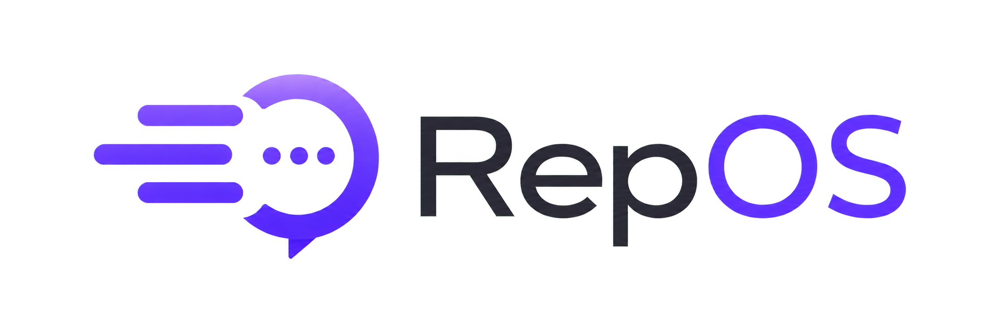

<p align="center">
  
</p>

# RepOS

RepOS is a prototype for managing support tickets, queues, customer history, and assignments. It uses an iSpring Water Systems demo workspace; workspace settings keep that demo content separate from the app.

## Core Features

- Ticket workflow dashboard for open, assigned, and closed support work
- Support queues with table and card views
- Internal support workspace with ticket detail, messages, notes, and customer context
- Ticket state tracking for status, ownership, priority, assignment, and follow-up work
- Admin tools for assignment users, workspace settings, and routing controls
- JSON-file persistence by default, with optional Postgres support through `DATABASE_URL`
- Local browser fallback state when the backend is unavailable
- Static Vercel demo path and Node-backed deployment path for backend demos

## Tech Stack

- HTML
- CSS
- JavaScript
- Node.js
- JSON-file persistence
- Optional Postgres through `pg`
- Vercel for static demo hosting
- Railway-compatible Node deployment path

## Local Development

Install dependencies:

```bash
npm install
```

Run the local server:

```bash
npm run dev
```

The app runs on:

```text
http://127.0.0.1:4173
```

Useful smoke check:

```bash
npm run smoke
```

## Runtime and Deployment

RepOS supports development, demo, and strict production authentication modes, optional enterprise SSO, JSON or Postgres persistence, and a Railway-compatible deployment path.

See [Production Operations](docs/production-operations.md) for environment variables, durable storage, first-admin setup, credential rotation, SSO configuration, health checks, backup, and restore guidance.

Project planning and implementation context are kept in [Project Context](PROJECT_CONTEXT.md), the [Project Backlog](docs/project-backlog.md), and the [Changelog](CHANGELOG.md). Completed visual QA and development history notes are archived under [docs/archive](docs/archive/).

## Current Status

The prototype includes a local backend, demo data, MVP auth/session behavior, JSON persistence, optional Postgres support, and local upload handling. Production-grade auth, email sync, order lookup, inventory lookup, and durable cloud file storage are not complete yet.

## Related Projects

- RepStack: review collection and pay-period tracking app
- RepReport: review parser and export helper
- RepGuard: evidence and claim review workspace
